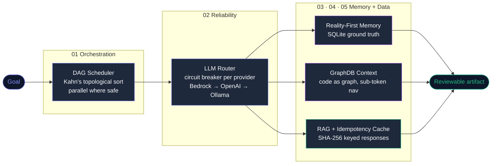
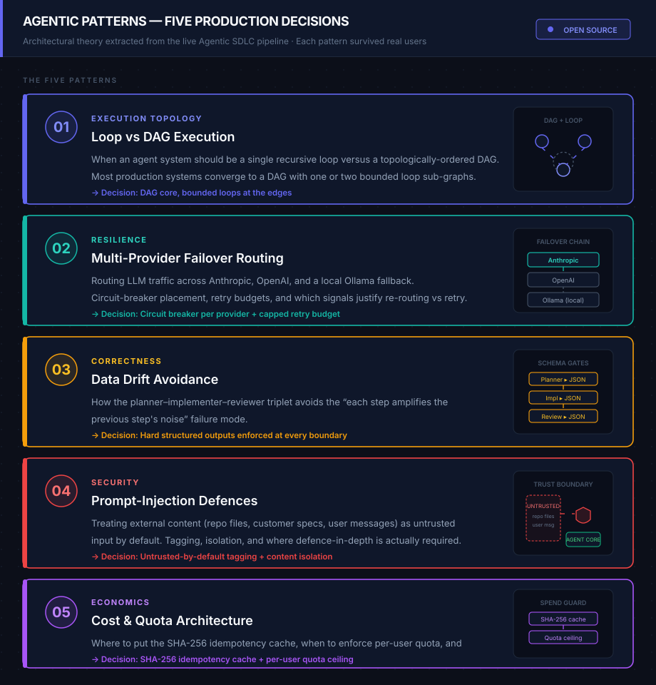

# Agentic Patterns

**7 architecture patterns for building production multi-agent AI systems** — distilled from 18 months of solo building across 8 shipped projects.

Not framework docs. Not tutorials. Patterns: the recurring problems, the trade-offs, and the decisions that held up under real load.

[](LICENSE)
[](CONTRIBUTING.md)

---

## Why this exists

Most agentic AI content in 2026 is either:
- "Here is how to use LangChain" — framework tutorials that age in 3 months
- Research papers — correct but impractical
- Vibe-coded demos — look great, break in production

This repo documents **what actually worked** when building real systems: a multi-agent SDLC engine, a 6-agent marketing OS, a programmatic video pipeline, and a cross-platform wellness platform. All written by one person, all shipped.

The problems are not unique. If you are building anything with multiple LLM agents, you will hit every problem documented here. These are the patterns that solved them.

---

## The 7 Patterns

| # | Doc | The Problem It Solves |
|---|---|---|
| 01 | [DAG vs Linear Chains](docs/01-dag-vs-linear.md) | Why sequential agent chains break on complex tasks and how a Directed Acyclic Graph fixes it |
| 02 | [Multi-Provider LLM Routing](docs/02-multi-provider-llm-routing.md) | How to build a system that keeps working when OpenAI has an outage, your free quota runs out, or a model is deprecated |
| 03 | [Reality-First Memory](docs/03-reality-first-memory.md) | Why agent memory systems drift from reality and how to keep them honest |
| 04 | [GraphDB for Agent Context](docs/04-graphdb-for-agent-context.md) | Sub-token-cost codebase navigation for agents that need structural code understanding |
| 05 | [RAG That Doesn't Suck](docs/05-rag-that-doesnt-suck.md) | SHA-256-keyed response caching, semantic filtering, hybrid search—what to embed vs what to keep ephemeral |
| 06 | [Self-Mode vs External-Mode](docs/06-self-mode-vs-external-mode.md) | How to safely build an agent system that can operate on itself without foot-gunning |
| 07 | [Anti-Drift](docs/07-anti-drift.md) | Preventing agents from hallucinating their own architecture over long sessions |

Start with **01** if you are designing a new pipeline. Start with **02** if you are fighting API reliability. Start with **07** if your agent system is behaving unpredictably after working fine last week.

## Visual Architecture

**Five patterns — how they connect:**



**Architecture reference (all 5 patterns annotated):**



**Constellation map (animated — open in browser):**

The `visual/` folder contains `visual-patterns.html` — a standalone animated constellation map showing how the 5 patterns connect and reinforce each other. No dependencies, no build step. Open directly in any browser.

```
open visual/visual-patterns.html
# or: python -m http.server 8080 → localhost:8080/visual/visual-patterns.html
```

> Full portfolio case study with live animations: [my-portfolio-github-io-beta-five.vercel.app/projects/agentic-patterns.html](https://my-portfolio-github-io-beta-five.vercel.app/projects/agentic-patterns.html)

---

## Quick-Start Template

Want a copy-paste scaffold before reading the docs? **[TEMPLATE.md](TEMPLATE.md)** is a complete multi-agent system template covering agent contracts, memory routing, reality files, security guardrails, observability, and recovery. Fill in the `<PLACEHOLDERS>` for your domain and you have a production-grade starting structure in under an hour.

---

## Who this is for

- **Architects & Senior Engineers** — building multi-agent systems, designing resilient infrastructure
- **Founding engineers** at AI startups figuring out production architecture
- **Solo builders** shipping agentic products without a team
- **Learners** (yes, even beginners!) — follow the **Beginner's Learning Path** below

### Beginner's Learning Path

New to multi-agent systems? Follow this sequence:

1. **Read [Pattern 02 — Multi-Provider LLM Routing](docs/02-multi-provider-llm-routing.md)**
   - Simplest concept: why single-provider systems fail, how to build fallback chains
   - No code required, all examples are pseudocode

2. **Run [agentic-systems 01 — Research Agent](https://github.com/shubham0086/agentic-systems/tree/main/01-research-agent)**
   - Live code that implements Pattern 02
   - Watch how Blackboard and routing work together

3. **Read [Pattern 01 — DAG vs Linear](docs/01-dag-vs-linear.md)**
   - Understand why agents need to coordinate
   - Learn Kahn's algorithm (5-minute explainer included)

4. **Run [agentic-systems 05 — Bug Triage](https://github.com/shubham0086/agentic-systems/tree/main/05-bug-triage)**
   - See DAGRunner in action (2 agents working together)

**Then** tackle the remaining patterns. You'll read them as a senior engineer would.

---

Not for: LLM beginners who haven't built a single chatbot yet (learn the basics first, then come back).

---

## What these patterns are NOT

- Not LangChain-specific or CrewAI-specific — patterns are framework-agnostic
- Not benchmarks or performance comparisons
- Not sponsored by any LLM provider

---

## Contributing

Found a better approach to one of these problems? Opened an issue? Fixed a diagram? PRs welcome. See [CONTRIBUTING.md](CONTRIBUTING.md).

---

## License

[CC BY 4.0](LICENSE) — use freely, with attribution.

---

*Built from experience with: Agentic-SDLC, Agency OS, ACE App Builder, KAAL Engine, MY-VIDEO, WellnessInYou + BODH.*
