# Pattern 02 — Multi-Provider LLM Routing

## The problem

Your agent system calls one LLM provider. Then one of these happens:

- OpenAI has an outage (it does, roughly monthly)
- Your free tier hits its hourly quota mid-pipeline
- A model you depend on is deprecated with 2 weeks notice
- Your budget runs out and you need the pipeline to keep running
- Rate limits kick in under load

A single-provider system fails completely in all five cases. The pipeline stops, the user gets an error, and you scramble to switch providers manually.

In 2026, the LLM provider landscape is also fragmented: the best model for code generation is not the same as the best for research summarization, which is not the same as the cheapest for simple formatting tasks. Routing everything to one model is both a reliability failure and a cost failure.

---

## Why naïve fallbacks fail

The obvious fix is: `try provider A, catch exception, try provider B`. This works for simple cases but breaks under real conditions:

**Problem 1: You don't know a provider is degraded until it times out.** If provider A hangs for 30 seconds before returning a 503, your pipeline waits 30 seconds before trying B. Multiply by 6 agents. Your 45-second pipeline becomes 4 minutes.

**Problem 2: Rate limits return 429, not exceptions.** Most fallback code catches connection errors. It doesn't catch a 429 from OpenAI, which just returns an HTTP error. Without explicit 429 handling, you retry the same provider that just told you it's overwhelmed.

**Problem 3: You blow your budget on fallbacks.** If your primary is a free model and your fallback is GPT-4o, a single bad hour can cost $50 in unexpected fallback traffic.

**Problem 4: Different tasks need different models.** Routing everything to Claude Opus for a simple formatting task wastes 10× the token cost for no quality gain.

---

## The pattern



Three components working together: **ordered model chains**, **per-provider timeouts**, and a **session-level circuit breaker**.

### 1. Ordered model chains

Every provider holds an ordered list of models. Within a provider, the system tries models in order — best quality first, cheapest/most-available last. When a model fails (rate limit, timeout, model deprecated), the next in the chain is tried automatically.

```javascript
const modelChains = {
  // Primary: MiniMax (free, fast)
  opencode: [
    'minimax-m2.5-free',
    'qwen3.6-plus-free',
    'deepseek-v4-flash-free',
    'nemotron-3-super-free',
  ],

  // Secondary: AWS Bedrock (credit-based, reliable)
  bedrock: [
    'qwen.qwen3-coder-30b-a3b-instruct',   // best for code
    'deepseek.v3.1',                        // strong general
    'us.meta.llama4-maverick-17b-128e-instruct-v1:0',
    'amazon.nova-pro-v1:0',                 // reliable fallback
    'amazon.nova-lite-v1:0',
    'amazon.nova-micro-v1:0',              // last resort
  ],

  // Tertiary: NVIDIA NIM (quality ladder)
  nim: [
    'meta/llama-3.3-70b-instruct',
    'meta/llama-3.1-70b-instruct',
    'mistralai/mixtral-8x7b-instruct',
    'meta/llama-3.1-8b-instruct',
  ],

  // Always-available local fallback — no API key, no quota
  ollama: [
    'qwen2.5-coder:7b',
    'llama3.1:8b',
  ],
};

// Provider priority order
const providerOrder = ['opencode', 'bedrock', 'nim', 'deepseek', 'gemini', 'ollama'];
```

### 2. Per-provider and per-role timeouts

Not all providers respond at the same speed. Not all agent roles need the same thinking time. Two separate timeout dimensions:

```javascript
const PROVIDER_TIMEOUTS = {
  opencode:    30_000,   // free tier — fast or nothing
  nim:         45_000,
  openrouter:  45_000,
  deepseek:    60_000,
  bedrock:     90_000,   // SigV4 overhead + model warmup
  gemini:      90_000,
  ollama:      90_000,   // local model — slower but free
};

const ROLE_TIMEOUTS = {
  Perceptor:   30_000,   // simple classification — should be instant
  Researcher:  60_000,   // web retrieval + summarization
  Auditor:     60_000,   // code review — bounded scope
  Architect:  300_000,   // complex planning — needs headroom
  Coder:      300_000,   // code generation — can be long
};

function getTimeout(provider, role) {
  // Use whichever is more restrictive — prevents a slow provider
  // from blocking a role that should be fast
  return Math.min(PROVIDER_TIMEOUTS[provider], ROLE_TIMEOUTS[role]);
}
```

### 3. Session-level circuit breaker

Once a provider exhausts every model in its chain during a run, mark it as exhausted for the rest of the session. Don't retry it — it told you it's done.

```javascript
class SessionCircuitBreaker {
  constructor() {
    this.exhausted = new Set();    // providers with no remaining models
    this.modelFailures = new Map(); // provider → Set of failed model IDs
  }

  isExhausted(provider) {
    return this.exhausted.has(provider);
  }

  recordFailure(provider, modelId) {
    if (!this.modelFailures.has(provider)) {
      this.modelFailures.set(provider, new Set());
    }
    this.modelFailures.get(provider).add(modelId);

    const failed = this.modelFailures.get(provider);
    const total = modelChains[provider].length;
    if (failed.size >= total) {
      this.exhausted.add(provider);
      console.warn(`[circuit] ${provider} exhausted — all ${total} models failed this session`);
    }
  }

  getNextModel(provider) {
    const failed = this.modelFailures.get(provider) || new Set();
    return modelChains[provider].find(m => !failed.has(m)) || null;
  }
}
```

### 4. The routing loop

```javascript
async function callWithFallover(prompt, role, breaker) {
  for (const provider of providerOrder) {
    if (breaker.isExhausted(provider)) continue;

    const model = breaker.getNextModel(provider);
    if (!model) continue;

    const timeout = getTimeout(provider, role);

    try {
      const result = await callProvider(provider, model, prompt, timeout);
      return result; // success — return immediately
    } catch (err) {
      const isRetryable = err.status === 429 || err.status === 503 || err.code === 'ETIMEDOUT';
      breaker.recordFailure(provider, model);

      if (!isRetryable) {
        // Hard failure (401, 400, model not found) — skip this provider entirely
        breaker.exhausted.add(provider);
      }

      continue; // try next model in chain, then next provider
    }
  }

  throw new Error('All providers exhausted — pipeline cannot continue');
}
```

---

## Cost routing: match model to task

Not every agent needs the most capable model. Add a model-tier concept:

```javascript
const ROLE_TIER = {
  Perceptor:   'fast',    // classify the goal — any model works
  Researcher:  'fast',    // summarize web content — doesn't need Opus-grade
  Architect:   'capable', // complex planning — needs quality
  Coder:       'capable', // code generation — needs quality
  Auditor:     'fast',    // review specific code — focused task, fast model fine
  Documenter:  'fast',    // write markdown — any model
};

const TIER_CHAINS = {
  fast:    ['opencode', 'nim', 'ollama'],   // cheapest/fastest first
  capable: ['bedrock', 'gemini', 'nim', 'ollama'], // quality first
};
```

This alone can cut your LLM cost 60-70% on a 6-agent pipeline — the majority of agent calls don't need the most expensive model.

---

## The local fallback is non-negotiable

Ollama (or any local model runner) as the final fallback removes the single point of failure that cloud-only systems share. If every cloud provider is rate-limited or down simultaneously:

- With Ollama: pipeline continues at lower quality, users get a result
- Without Ollama: pipeline fails completely, users get nothing

The quality gap between a local 7B model and GPT-4o is real. But a lower-quality result delivered is infinitely better than a timeout. For most agent steps — summarization, formatting, simple analysis — a 7B model is sufficient.

Local model requirement: ~8GB VRAM for `qwen2.5-coder:7b`. Worthwhile for any production system.

---

## Trade-offs

**Complexity cost**: This is real. Three components (chains, timeouts, circuit breaker) is more complex than a single provider call. The payoff is proportional to how much your pipeline costs to restart when it fails.

**When single-provider is fine**:
- Development/prototyping where downtime is acceptable
- Pipelines that run infrequently (manual triggers, not automated)
- When you have a single-provider SLA guarantee (enterprise contracts)

**When multi-provider is necessary**:
- Any automated pipeline that runs unattended
- Pipelines with costs high enough that budget overruns matter
- Production systems where user-facing failures have consequences

---

## Where this came from

The specific model chains, timeouts, and circuit breaker in this doc come from **Agentic-SDLC** — a multi-agent development engine that spans 9 LLM providers with local Ollama as final fallback.

The system was built after two separate production failures: an OpenAI outage mid-pipeline and a free-tier quota exhaustion that caused 47 consecutive errors before the issue was diagnosed. Both failures were preventable with the pattern above.

---

*Previous: [Pattern 01 — DAG vs Linear Chains](01-dag-vs-linear.md)*
*Next: [Pattern 03 — Reality-First Memory](03-reality-first-memory.md)*
